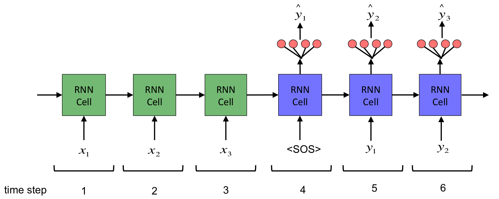
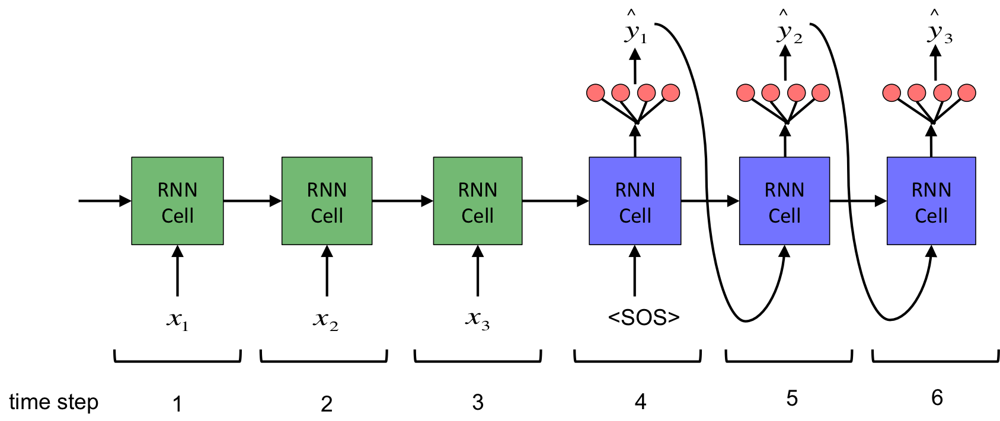

# Basic Encoder-Decoder Architecture

Encoder-Decoder architecture aims to solve problems in which the input sequence typically has different length than that of the output sequence length. Some of the applications are:
	
* `Machine translation` where the input is a sentence/paragraph in one language and while output is the same sentence/paragraph in other  language.
* `Text summary` where the input is a sentence/paragraph/article while the output is summary of that sentence/paragraph/article.
* `Question-Answering` where the input is a set of questions while the output is their answers.
* `Image captioning` where the input is an image while the output is the caption of that image. 

The standard RNN cannot handle the scenario where the input sequence length is different from the output sequence length. The solution is using a dual-RNN system where one RNN called `encoder` is to process the input sequence and pass whatever it understands to the other RNN called `decoder` that processes the information passed from `encoder` and generates output sequence. A high-level encoder-decoder architecture is shown below:


Actually, this is very common idea in deep learning. In the first stage, the encoder takes raw input such as text, image, or audio and generates vector representation of the input. In the second stage, the decoder produces new data from that vector representation. This encoder-decoder type of architecture can be used for any kind of request-response tasks, the most basic of which is autoencoder that tries to reproduce what it put in. 

Figure below shows the `encoder-decoder` architecture in more detailed way:




## Encoder

The encoder typically is composed of:

* Embedding layer
* RNN layer (LSTM, GRU, BiLSTM)
	


We ignore embedding layer for simplicity. RNN layer of encoder has following important points:

* No outputs because we are not making predictions
* Only keep final state (in this particular example the final state is S3). 
	* Since we only keep final state, we do not keep any time information.
	* We can think of this final state as the information that the encoder can understand from the input sequence. The final state is compact representation of the input sequence.
* If we apply `Attention` mechanism to the `Encoder-Decoder` architecture, we will keep all states at every time steps of the encoder and pass these states to decoder.
* In Keras, this means 	`return_sequences` is False

## Decoder

The decoder is more involoved and it typicall composed of:

* Embedding layer
* RNN layer
* Dense output layer


We ignore embedding layer for simplicity. RNN layer of decoder has following important points:

* This is a totally new RNN layer different from RNN layer in encoder.
* RNN cell must have the same number of hidden units as the ones in RNN cell of encoder. This is because the final state (e.g., S3) from the encoder will be passed in as initial state for RNN cell of the decoder.
* Pass `<Start_Of_Sequence>` token as the frist input to the RNN cell.

What should the input be for time step 5 and 6?

* we actually have different ways of feeding the RNN cell based on whether we are training the model or making inference.

## Teacher forcing

When training the model, we apply a mechanism called `teacher forcing`, which basically means that 

* We feed the decoder RNN layer with true target sequences 
	* It is important to note that we need to offset the input sequence by 1 time step (i.e., `<SOS>`). If we do not do this, the input word will simply match the output word and the RNN will simply learn to copy the input, which reder the model useless.
* Target sequences (in a minibatch) that we feed into RNN layer have the same length.


The reasons for applying teacher forcing are:

* It is difficult to learn by generating entire sentence at once.
* Think about how we learn a language
	* We are trying to translate a sentence into a foreign language. If we get a word wrong, the teacher may correct us, allowing us to work off the corrected sentence so far.

## Inference

For inferencing (or testing), we do not have targets. We will make inference word by word based on previous predicted word. Therefore:

* We feed the decoder one word at a time. In other words, the decoder input length during inferencing is 1. 
* We will be doing a loop and generate each word one at a time. 


## Two Decoders

We have different ways of feeding input into decoder's RNN layer for training and inferencing respectively. More specifically, to implement this with Keras:

1. During training, decoder input length is Ty
2. During inferencing, decoder input length is 1

However, the #1 and # 2 conflict with each other, since Keras model must have constant-sized inputs. To solve this, we will use two decoders, one for training and the other for inferencing.

* The two decoders use the same RNN layer but use different inputs.

Following shows the pseudocode:

We first define necessary layers:

```python
emb = Embedding()
lstm = LSTM()
dense = Dense()
```

Then, we define the first model which is for training purpose only

```python
input1 = Input(length=Ty)

# define the decoder
output1 = dense(lstm(emb(input1)))

model1 = model(inputs=input1, outputs=output1)

model1.fit(x_train, y_train)
```
We define the second model which is for inferencing/samples. The second model will 

* Use the previously defined decoder layer that is alreay part of the trained model. 
* Use an new input layer where the input length is 1. 

```python
input2 = Input(length=1)

# use previously trained decoder with input2
output2 = dense(lstm(emb(input2)))

model2 = model(inputs=input2, outputs=output2)

# h has the initial value of final state from encoder
# x has the initial value of <SOS>
while x != <EOS>
	x, h = model2.predict(x, h)
```

Following picture shows the the `encoder-decoder` architectures for training and inferencing respectively:





## Seq2Seq Applications

* Question Answering
	* Given a storing + question, produce an answer
	* A test of reading comprehension
	* Story and questions are concatenated to form an input sequence which is transformed by encoder into a vector representation which in turn is decoded to form an answer.
	
* Chatbots
	* Dataset takes similar format
		* Request -> Response
	* The Seq2Seq architecture may not be well-suited to complicated Chatbots
		* Real conversion involves an idea spanning multiple back-and-forth statements by the agents involved - can even return to a previous topic much later.
		* Conversion with only binary "question-answering" pairs is awkward and would have no flow. 
			* A decent chatbot should be able to remember not only the conversion happened in the past but what it had said to itself.
		* Seq2Seq only learns to memorize the request-response pairs.
	* Simple chatbot application in which the machine is leading the converstion (in other words, the machine determines the context) is much simpler to implement.
