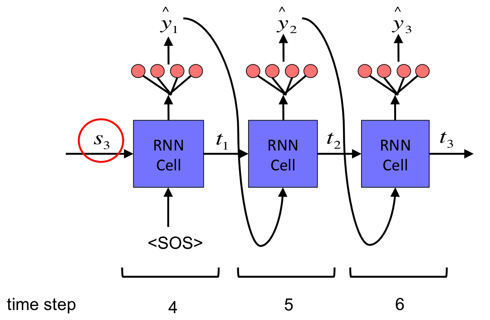

# Basic Encoder-Decoder Architecture

Encoder-Decoder architecture aims to solve problems in which the input sequence typically has difference length than that of the output sequence length. Some of the applications are:
	
* `Machine translation` where the input is a sentence/paragraph in one language and while output is the same sentence/paragraph in other  language.
* `Text summary` where the input is a sentence/paragraph/article while the output is summary of that sentence/paragraph/article.
* `Question-Answering` where the input is a set of questions while the output is their answers.
* `Image captioning` where the input is an image while the output is the caption of that image. 

The standard RNN cannot handle the scenario where the input sequence length is different from the output sequence length. The solution is using a dual-RNN system where one RNN called `encoder` is to process the input sequence and pass whatever it understands to the other RNN called `decoder` that processes the information passed from `encoder` and generates output sequence. A high-level encoder-decoder architecture is shown below:

Actually, this is very common idea in deep learning. In the first stage, the encoder takes raw input such as text, image, or audio and generates vector representation of the input. In the second stage, the decoder produces new data from that vector representation. This encoder-decoder type of architecture can be used for any kind of request-response tasks, the most basic of which is autoencoder that tries to reproduce what it put in. 

## Encoder

The encoder typically is composed of:

* Embedding layer
* RNN layer (LSTM, GRU, BiLSTM)
	

We ignore embedding layer for simplicity. RNN layer of encoder has following important points:

* No outputs because we are not making predictions
* Only keep final state S3; does not comtain any time information
* In Keras, this means 	`return_sequences` is False

## Decoder

The decoder is more complex and it typicall composed of:

* Embedding layer
* RNN layer
* Dense output layer

We ignore embedding layer for simplicity. RNN layer of decoder has following important points:

* This is a totally new RNN layer different from RNN layer in encoder.
* RNN cell must have the same number of hidden units as the ones in RNN cell of encoder.
* The final state S3 from encoder is the initial state for RNN cell of the decoder.
* Pass `<Start_Of_Sequence>` token as the frist input to the RNN cell.

What should the input be for time step 5 and 6?

* we actually have different ways of feeding the RNN cell based on whether we are training the model or making inference.

## Teacher forcing

When training the model, we apply a procedure called `teacher forcing`, which basically means that 

* We feed the decoder RNN layer with true target sequences (offset by `<SOS>`).
* Target sequences (in a minibatch) that we feed into RNN layer have the same length.

The reasons for applying teacher forcing are:

* It is difficult to learn by generating entire sentence at once.
* Think about how we learn a language
	* We are trying to translate a sentence into a foreign language. If we get a word wrong, the teacher may correct us, allowing us to work off the corrected sentence so far.

## Inference

For inferencing (or testing), we do not have targets. We will make inference word by word based on previous predicted word. 

* We will be doing a loop and generate each word one at a time. 
* The decoder input length during inferencing is 1. 
 

## Two Decoders

Because we have different ways of feeding input into decoder's RNN layer for training and inferencing respectively, we will use two decoders, one for training and the other for inferencing.

* The two decoders use the same RNN layer but use different inputs.

Following shows the pseudocode: