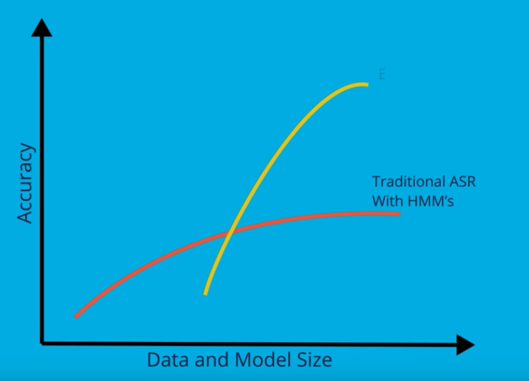
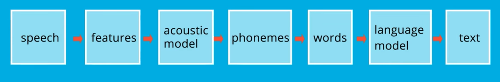
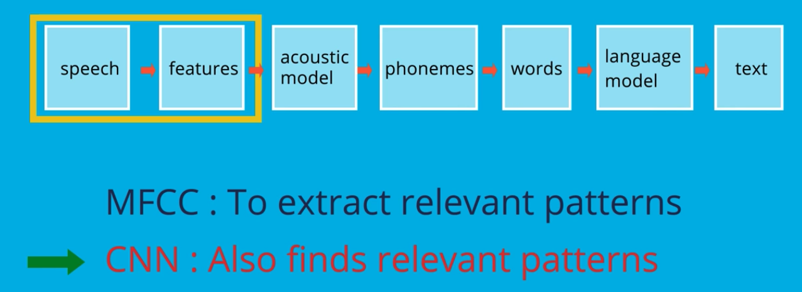
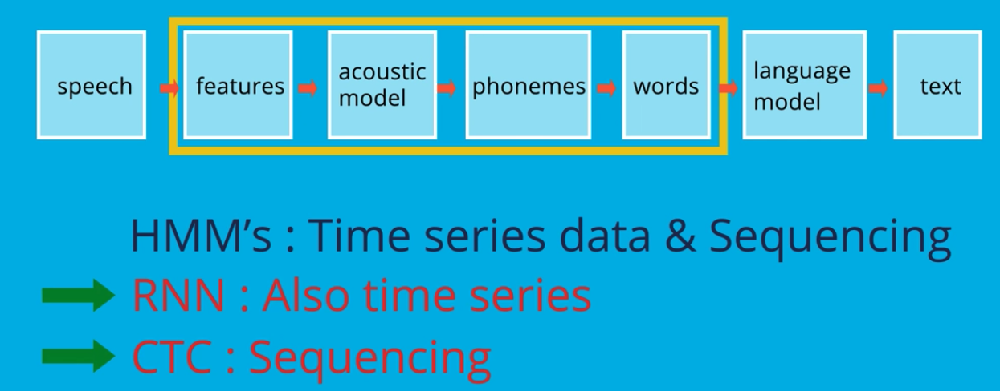
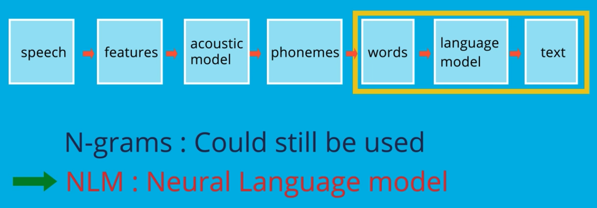

# Deep Neural Network as Speech Models

If HMM works, why do we need a new model. It comes down to potential.

Suppose we have all the data we need and all the processing power we want. According to Baidu's Adam Coates ina recent presentation, additional training of a traditional ASR levels off in accuracy. Meanwhile, deep neural network solutions are unimpressive with small datasets. But they shine as we increase data and model sizes. 

The traditional Speech Recognition Model pipeline:

1. Extract features from the audio speech signal with MFCC
2. Use an HMM acounstic model to convert features to sound units, phonemes, or words
3. Then, use statistical language models such as N-grams to straighten out language ambiguities and create the final text sequence.

It is possible to replace many parts with a multiple layer deep neural network. Let's get a little intuition as to why they can be replaced.

> In feature extraction, we have used models based on human sound production and perception to convert a spectrogram into features. This is similar, intuitively, to the idea of using Convolutional Neural Network (CNN) to extract features from image data. Spectrograms are visual representations of speech. Therefore, we ought to be able to let a CNN find relevant features for speech in the same way.

> An acoustic model implemented with HMMs includes transition probabilities to organize time series data. Recurrent Neural Network (RNN) can also track time series data through memory. 

> The traditional model also uses HMMs to sequence sound units into words. The RNNs Produce probability densities over each time slice. So we need another way to solve the sequencing issue. A Connectionist Temporal Classification layer (CTC) is used to convert the RNN outputs into words. Therefore, we can replace the acounstic portion of the pipeline with a combination of RNN and CTC layers

> The end-to-end DNN still makes linguistic errors, especially on words that it has not seen in enough examples, It should be possible for the system to learn language probabilities for audio data. But presently there just is not enough. 

> The existing technology of N-grams can still be used. Alternately, a Neural Language Model can be trained on massive amounts of available text. Using an NLM layer, the probabilities of spelling and context can be rescored for the system.

## References: Deep Neural Network ASR

**Deep Speech 2**

The following presentation, slides, and paper from Baidu on DeepSpeech 2 were important resources for the development of this course and its capstone project:

* [Amodei, Dario, et al. "Deep speech 2: End-to-end speech recognition in english and mandarin." International Conference on Machine Learning. 2016.](https://arxiv.org/pdf/1512.02595v1.pdf)
* [Presentation](https://www.youtube.com/watch?v=g-sndkf7mCs)
* [Slides](https://cs.stanford.edu/~acoates/ba_dls_speech2016.pdf)

**Language modeling with CTC**

Gram-CTC from Baidu on integrating a language model into CTC for better performance:

* [Liu, Hairong, et al. "Gram-CTC: Automatic Unit Selection and Target Decomposition for Sequence Labelling." arXiv preprint arXiv:1703.00096 (2017).](https://arxiv.org/pdf/1703.00096.pdf)

Language modeling with CTC based on weighted finite-state transducers (WFSTs):

* [Miao, Yajie, Mohammad Gowayyed, and Florian Metze. "EESEN: End-to-end speech recognition using deep RNN models and WFST-based decoding." Automatic Speech Recognition and Understanding (ASRU), 2015 IEEE Workshop on. IEEE, 2015.](https://arxiv.org/pdf/1507.08240.pdf)
* [Slides](http://people.csail.mit.edu/jrg/meetings/CTC-Dec07.pdf) 